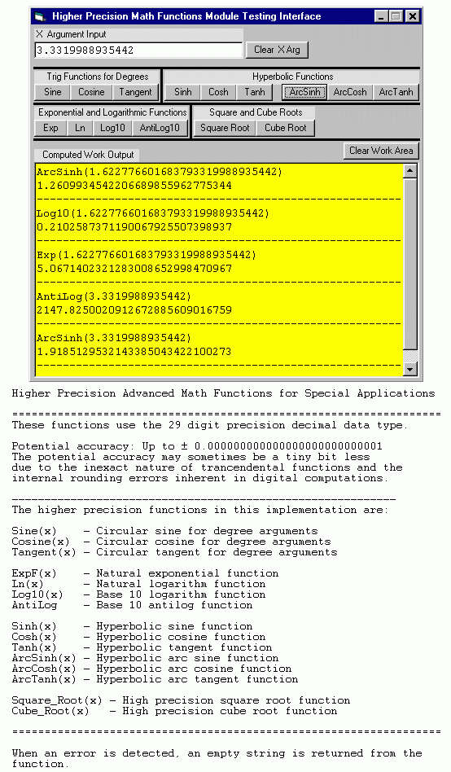



## Higher Precision Math Functions v1\.0

### Description

An external function module to compute higher precision math functions for special applications.
 
### More Info
 
This module is meant for anyone needing certain math functions to a precision that exceeds the usual 16 digits limitation of conventional VB functions.

The functions are constrained only by the limitations of the 29 digit decimal data type, which is sufficient for most practical problems.

Uses the decimal data type to compute values of some advanced math functions with up 26-28 digits precision.

             |
---                |---
**Submitted On**   |2001-11-27 17:53:46
**By**             |[Jay Tanner](https://github.com/Planet-Source-Code/PSCIndex/blob/master/ByAuthor/jay-tanner.md)
**Level**          |Advanced
**User Rating**    |5.0 (35 globes from 7 users)
**Compatibility**  |VB 5\.0, VB 6\.0
**Category**       |[Math/ Dates](https://github.com/Planet-Source-Code/PSCIndex/blob/master/ByCategory/math-dates__1-37.md)
**World**          |[Visual Basic](https://github.com/Planet-Source-Code/PSCIndex/blob/master/ByWorld/visual-basic.md)
**Archive File**   |[Higher\_Pre3815211282001\.zip](https://github.com/Planet-Source-Code/jay-tanner-higher-precision-math-functions-v1-0__1-29292/archive/master.zip)

